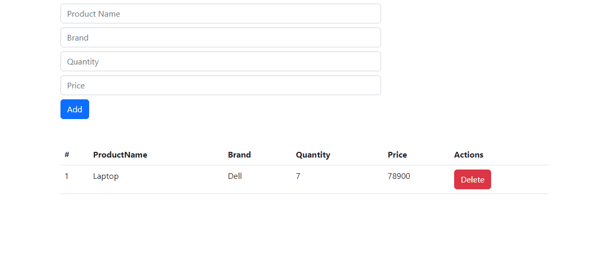

## React Product Management System

### Description
### Problem Statement

An electronics store wants to modify their business into a digital system that will help them to manage the data of products in a flow. To do that, they want a web application as shown below:



You have to complete the given React Project which has the following components:
- AddProduct - This Component should contain a form to add a new product. It should have 4 text inputs for Product Name, Brand, Quantity, Price & submit button.
- ProductsData - In this component a table to show the data of the products should be implemented. A delete button should be there in the last(Actions) column for each row.

### To be implemented:
- In AddProduct.js, write the code for the form fields and complete the given functions accordingly. The data on form submission should be passed to the function in App.js and the POST method is to be implemented there.
- In ProductsData.js, write the code to show the product's data in each row by iterating over the products' array. A delete function in App.js should be invoked on clicking the delete button with the specified product's id which is passed through props. The DELETE method of the APIs should be implemented in that function.
- In App.js, write code to make the respective API calls. Also, pass the required props to the respective Components.

### Prerequisites

1. Fork this boilerplate repository
2. Clone the boilerplate repository and cd into it
3. Install dependencies using npm install
4. Run the backend json-server db.json which shall run on port:3001
5. Run the frontend using npm run start which shall run on port:3000

### API details:

A JSON server should start on port 3001. After the server starts, get the URL of json-server and use it as the host URL for API calls to perform the following tasks:

1) Save Product to db.json on submitting the Add Product form:
```javascript
POST request to http://localhost:3001/products
```
2) Get All Products to show in the ProductsData component:
```javascript
GET request to http://localhost:3001/products
```
3) Delete a Product by clicking the delete button in the Actions column:
```javascript
DELETE request to http://localhost:3001/products/{productId}
```

These methods are to be implemented in the App.js file using fetch or axios.

### Point to be noted:

- Read the instructions carefully to understand the problem statement.
- No additional dependencies needs to be installed in the boilerplate.
- Bootstrap is by default set in index.html via CDN. No need to install bootstrap seperately.
- Do not delete any existing code of the boilerplate.